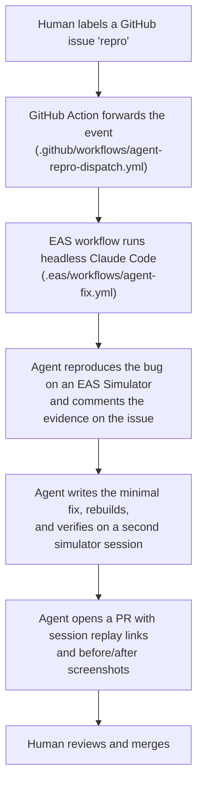

# OpenMulticam

An open, professional multicamera video app for iPhone. Record two cameras at the same time: two synchronized files, a live picture-in-picture composite, or a 50/50 split. Built with [Expo](https://expo.dev).

This repo demonstrates two things:

1. **Native-feeling, frame-sensitive apps with Expo.** React Native owns the shell. A local Swift Expo module owns everything the camera pipeline needs: `AVCaptureMultiCamSession`, a native capture state machine, recording writers, and the preview surface.
2. **Agentic EAS Workflows.** Label a GitHub issue `repro` and a headless agent reproduces the bug on a cloud simulator, fixes it, verifies the fix on-device, and opens a PR with watchable proof. A human reviews and merges.

## The app

The primary user is a solo creator, interviewer, or educator who wants two synchronized perspectives from one device.

- Open straight into a live camera preview
- Select any camera pair the current device can actually run together - capabilities come from the hardware, not a static device list
- Record discrete dual files, a movable picture-in-picture composite, or a 50/50 split composite
- Control focus and exposure for each camera independently
- See recording health, audio levels, storage, and thermal pressure while they are actionable
- Keep every take in an internal library and batch-export through native system surfaces
- Degrade honestly on unsupported hardware instead of showing controls that cannot work

Release 1 records 1080p H.264 at 24, 25, or 30 fps, iPhone only, iOS 18.6+. The app is private and local-first: no account, no backend, no cloud sync. Diagnostics telemetry exists but stays off unless you configure an endpoint via env vars.

## Architecture: Expo shell, Swift core

The split is deliberate. JavaScript never touches a video frame.

```
src/                        React Native shell (Expo Router, @expo/ui, Reanimated)
modules/multicam-capture/   Local Swift Expo module - the capture core
  ios/CaptureSessionService.swift    AVCaptureMultiCamSession ownership
  ios/CaptureStateMachine.swift      capture lifecycle, independent of the JS thread
  ios/CaptureDeviceDiscovery.swift   supportedMultiCamDeviceSets -> real capabilities
  ios/CaptureRecordingWriter.swift   atomic recording sets, dual writers
  ios/CapturePipLayout.swift         composite layout
  ios/CaptureSurfaceView.swift       the preview surface
```

Key platform contracts the native core enforces:

- `supportedMultiCamDeviceSets` is the source of truth for which camera pairs can run together
- Every selected format must report `isMultiCamSupported`
- `hardwareCost` and `systemPressureCost` gate what the app promises before recording starts
- Preview, session configuration, writers, and recording run off the main thread

The shell uses the same native-feel stack as the rest of Expo SDK 57: [`@expo/ui`](https://docs.expo.dev/versions/latest/sdk/ui/) (real SwiftUI from React), `expo-glass-effect`, `expo-video` for playback, `expo-media-library` for export, `expo-sqlite` for the library, and Reanimated 4.

## The agent pipeline

A bug report becomes a verified fix PR without a human opening Xcode.



Every run publishes the simulator session URLs (repro and verification) plus a before-screenshot and an after-screenshot. Anyone can watch the bug happen and watch it fixed. The agent never merges, never touches `main`, never force-pushes. The full policy lives in [`.agents/prompts/fix-prompt.md`](.agents/prompts/fix-prompt.md).

Several fixes in the git history shipped through this loop, including simulator camera injection support and picture-in-picture recording reliability.

Secrets required: `EXPO_TOKEN` as a GitHub repo secret, plus `CLAUDE_CODE_OAUTH_TOKEN` (from `claude setup-token`), `GITHUB_TOKEN` (fine-grained PAT), and `EXPO_TOKEN` in the EAS `production` environment.

Same pipeline as [rami-maalouf/habit-tracker](https://github.com/rami-maalouf/habit-tracker); the pattern originates from [SchroederNathan/clarity](https://github.com/SchroederNathan/clarity).

## Run it yourself

Requires Bun and Xcode. The local native module means the app needs a development build - it does not run in Expo Go.

```bash
bun install
bun run ios          # build and run on a simulator or device
bun run start        # start the dev server (dev client)
```

Multicam capture requires real hardware; the simulator gets injected camera input for UI work.

Quality gates:

```bash
bun run lint             # zero warnings allowed
bun run typecheck
bun run test             # jest suites
bun run test:native      # native module tests
bun run test:e2e:sim     # simulator e2e runner
bun run test:e2e:device  # device e2e runner
bun run validate         # repository checks + lint + typecheck + coverage + expo-doctor
```

Cloud builds use EAS with the profiles in [`eas.json`](eas.json): `development`, `simulator`, `preview-simulator` (what the fix agent uses), `preview`, and `production`.

## How it was built

The product was specified before it was implemented: [`SPEC.md`](SPEC.md) resolves the product decisions, the reference capabilities, and the Apple platform contracts. Claude Code implemented against that spec, with the task history under [`tasks/`](tasks).
